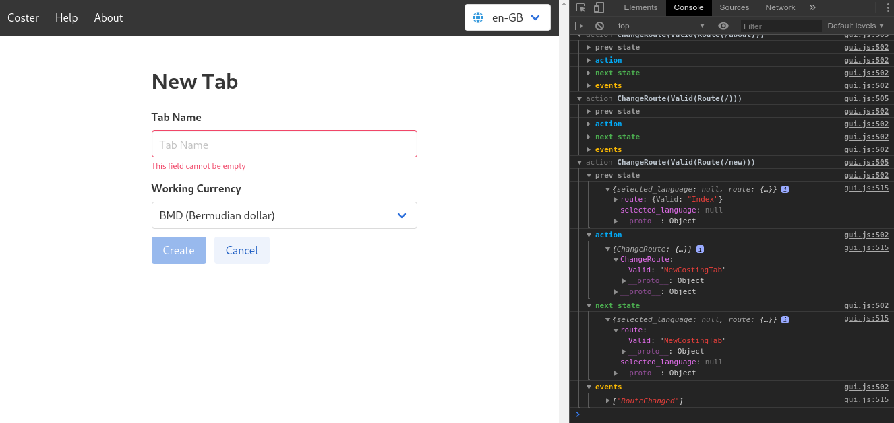

# reactive-state 

This library is inspired by [redux](https://redux.js.org/), and designed to be
used within Rust GUI applications to have centralised global state which behaves
in a predictable way.

The behaviour of the system is customisable via middleware, and provided in this
library are a couple of examples, a simple logger, and a web based logger
inspired by [redux-logger](https://github.com/LogRocket/redux-logger).

*Web Logger Middleware*
