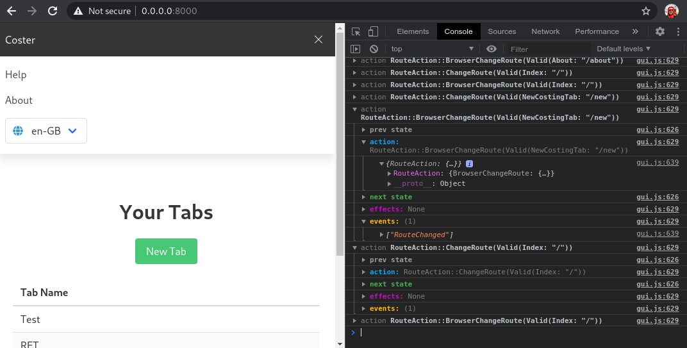

# reactive-state [](https://crates.io/crates/reactive-state) [](https://docs.rs/reactive-state/) [](https://github.com/kellpossible/reactive-state/blob/master/LICENSE.txt) [](https://github.com/kellpossible/reactive-state/actions?query=workflow%3ARust)

This library is inspired by [redux](https://redux.js.org/), and designed to be
used within Rust GUI applications to manage centralised global state which
behaves in a predictable way.

## Usage

In your `Cargo.toml` dependencies section:

```toml
[dependencies]
reactive-state = "0.1"
```

### Optional Features

The following optional crate features can be enabled:

+ `"simple_logger"` - Logging middleware in the `simple_logger` module which uses the `log` macros.
+ `"web_logger"` - Logging middleware in the  `web_logger` module, for applications running  in the browser using [wasm-bindgen](https://crates.io/crates/wasm-bindgen).
+ `"yew"` - Support for compatibility trait implementations on [yew](https://crates.io/crates/yew) types.

## Middleware

The behaviour of the system is customisable via middleware, and provided in this
library are a couple of examples, a simple logger, and a web based logger
inspired by [redux-logger](https://github.com/LogRocket/redux-logger).


*The `web_logger` Middleware*

### Available Middleware

Aside from the built in middleware `web_logger` and `simple_logger` (available via crate features), here is a list of available middleware crates:

+ `switch-router-middleware` - Routing middleware for [reactive-state](https://crates.io/crates/reactive-state), which makes use of [switch-router](https://github.com/kellpossible/switch-router).